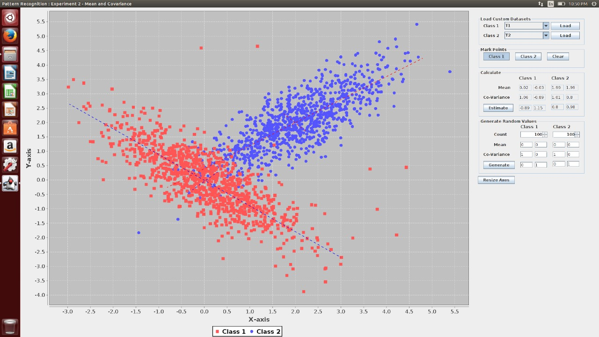

# Here are the prompts that I had given to Claude to get the webpages

## Base Image

This is the base image that I had used

# Image Uploading on 4 O

> I have given a screenshot of a simulation of mean and covariance simulator. I want it in a very modern dark interface
> using html, css and js. IT SHOULD BE RESPONSIVE.Use d3.js to maybe help you with visualisation.U have to implement all
> the functionalities in it. Feel free to write all the formulas needed for me. Incase of any questions ask to me at the
> end

### Output can be seen at [Prompt 1](ChatGPT_1.html)

The output is pretty bad since, features like custom adding points and resizing axes are not there.

# Code uploading to O3 Reasoning Model
So, the code I gave to the reasoning model to correct it
> Correct the code that I have given. Its exisiting features like generating points for both classes are not working. It also doesnt have the complete
feature list implemented like resizing axes,zoom and adding custom data points.Add more features as you see fit. Add
least an extra feature 

### Output can be seen at [Prompt 2](ChatGPT_2.html)
This one was better but, implementation of Custom Points was wrong

# Prompt 3
> I didn't like the adding custom point feature. I need an option to ask if it is for class 1 or class 2. The moment I add a point the overall mean and var of the class should change. So, I need you to make table for the final calc and all after custom points. Also, do not make me do the point always. If I select custom points for one class, I should be able to do that continoulsly for that class till I choose some other option.
Change the UI as you see fit 

### Output can be seen at [Prompt 3](ChatGPT_3.html)
This one was far good since now, the basic functionalities work but, the UI looks a little bad and resize axes button is not there

# Prompt 4
> the resize axes feature is not there. Add it also. The axes should autoupdate  if some points gets cut out
### Output can be seen at [Prompt 4](ChatGPT_4.html)
 Now, this one works. I am little sceptical if the auto axes is working right or manipulating the points a little
 The zoom feature is also a little buggy in this